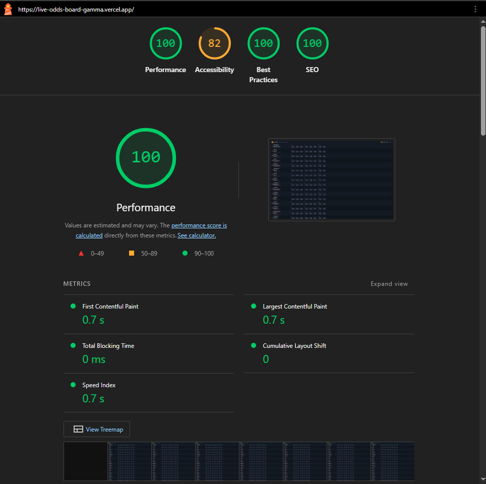

# Live Odds Board

A virtualized real-time live odds board displaying 10,000 matches updating via a mock WebSocket.

## Live demo

**https://live-odds-board-gamma.vercel.app**

## Performance

Lighthouse on the live deployment:



| Metric | Value |
|---|---|
| Performance | **100** |
| First Contentful Paint | 0.7s |
| Largest Contentful Paint | 0.7s |
| Total Blocking Time | 0ms |
| Cumulative Layout Shift | 0 |
| Speed Index | 0.7s |
| Best Practices | 100 |
| SEO | 100 |

## Highlights

- **10,000 matches**, virtualized via `react-window` (only the visible rows live in the DOM)
- **Mock WebSocket** with configurable update rate (1–1000 updates/sec via the dev panel)
- **rAF batching** of incoming updates — at most one store write per animation frame, regardless of message rate
- **Per-row Zustand selectors** — only matches whose data changed re-render; verified by the in-app render counter
- **Persistence** of selections, scroll position, and odds format via `localStorage`
- **1-second flash highlight** on odds change (green up, red down)
- **Odds format toggle** (decimal / fractional / american)
- **Mobile responsive** — `sm` shows 1X2, `md` adds Double Chance, `lg` adds Over/Under
- **Suspended-market state** ready in the data model (cells render disabled when `status !== 'open'`)
- **Dev panel** with intensity slider, render counter, kill-switch, and clear-selections — visible proof of the perf claim

## How to verify the perf claim

1. Open the live demo (or `npm run dev`)
2. Click **DEV** in the header to open the panel
3. Drag the **intensity** slider to 500 updates/sec
4. Watch **renders/sec** — only the visible rows whose data changed re-render, not all 10,000
5. Click **Kill WS** to confirm everything stops cleanly; **Resume** to start again
6. Click any odd to select it (amber highlight). Refresh — selection and scroll position survive.

## Architecture

```
WS Mock (setInterval) ──► Coalescer (rAF batch) ──► matchStore (Zustand)
                                                          │
                              ┌───────────────────────────┴──────────────────────┐
                              ▼                                                  ▼
                       Row (per-id selector)                          uiStore (persist)
                              │                                       selections, scroll, format
                              ▼
                       memo + reconcile
                              │
                              ▼
                             DOM
```

Three load-bearing decisions:

1. **Per-row Zustand selectors.** Each row subscribes to `matches[id]`. Reference equality means only the row whose match changed re-renders. The other 9,999 are skipped at the selector boundary — before reconciliation even starts.
2. **rAF batching of WS messages.** A `Coalescer` collects incoming patches and applies them once per animation frame. Even at 1,000 messages/sec, the store is updated at most ~60 times/sec.
3. **`react-window` virtualization.** Only rows in the viewport (plus a small overscan) are mounted. The rest are absolute-positioned virtual space.

## Why CSR (and not SSR)

Live odds are real-time, post-auth, and not SEO-relevant. Server-rendering odds would prerender values that are stale on arrival and force a hydration wave once the WS catches up. SSG/ISR don't apply to data that changes every second. In a Next.js production deployment the right shape would be RSC for the static shell + a CSR island for the board with a WS subscription — for this Vite test task, that overhead isn't justified.

## Tech stack

- Vite 8 + React 19 + TypeScript (strict)
- Zustand 5 (with `persist` middleware)
- react-window v2 (`List` + `useListRef`)
- Tailwind CSS 4 (CSS custom properties for theming)
- lucide-react (sport icons)
- Vitest + Testing Library

## Run locally

```bash
npm install
npm run dev
```

Build and preview the production bundle:

```bash
npm run build
npm run preview
```

Tests:

```bash
npm run test
```

## Project structure

```
src/
├── data/         match generator + teams + sport icons
├── store/        zustand stores (matches volatile, ui persisted)
├── ws/           mock WS producer + rAF coalescer
├── components/   Board, Row, OddsCell, MarketGroup, Header, DevPanel
├── hooks/        useFlash
└── utils/        formatOdds, formatTime
tests/
├── generateMatches.test.ts
├── formatOdds.test.ts
└── coalescer.test.ts
```

## What's intentionally out of scope

To keep this honest and ship-quality within the time budget:

- No Web Worker for the WS mock — would lift to one for 100k+ scale
- No reconnect-with-snapshot reconciliation
- No betslip with stake input
- No keyboard navigation through rows
- No exhaustive E2E tests (Vitest covers pure logic: formatter, generator, coalescer)

## Future work

- Lift WS to a Web Worker so the main thread stays fully free at higher scales
- Real betslip with stake input + price-acceptance modes (any change / higher only / always ask)
- BFF that shapes the feed per user (currency, region, viewport-only subscriptions)
- Reconnect-with-snapshot reconciliation + sequence-number ordering on real WS
- Keyboard navigation + ARIA-live announcements for screen readers
